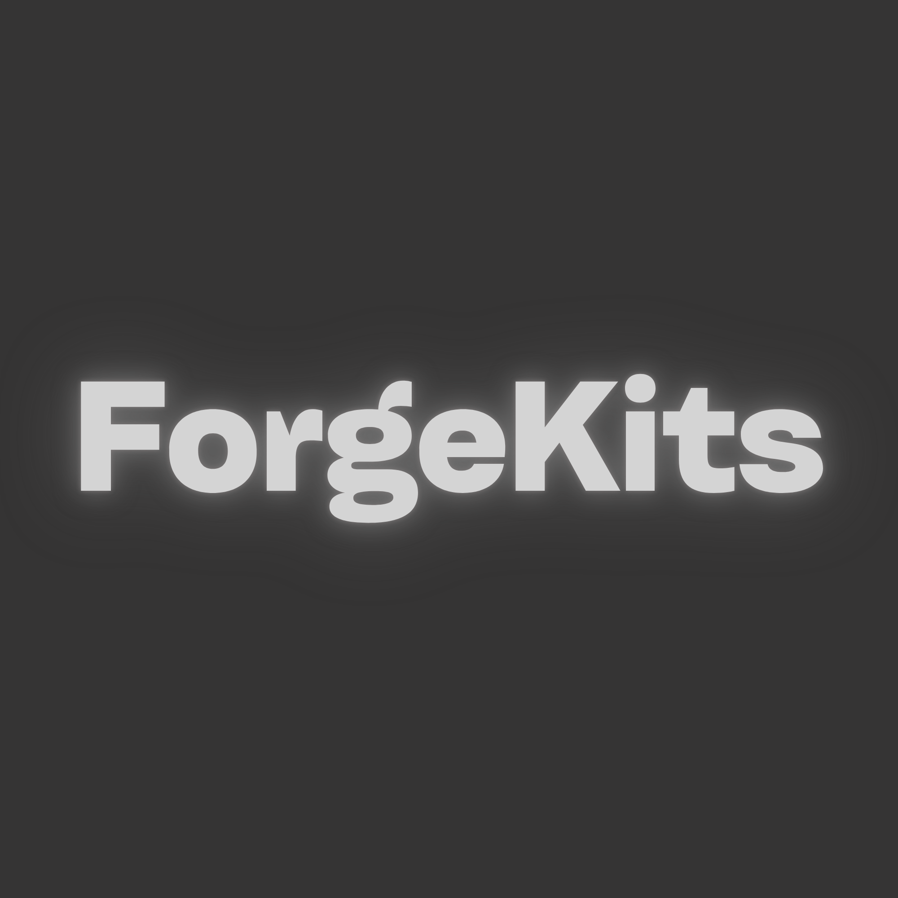
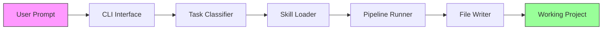
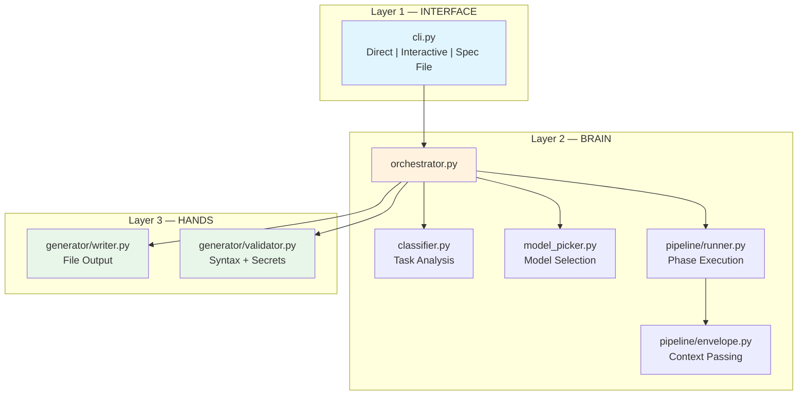
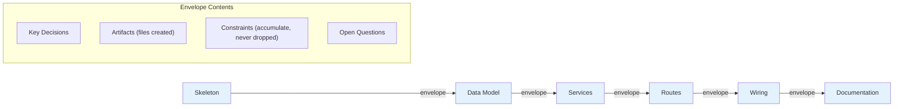
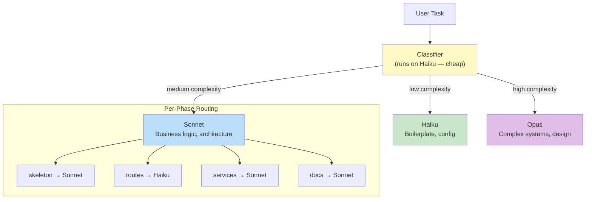
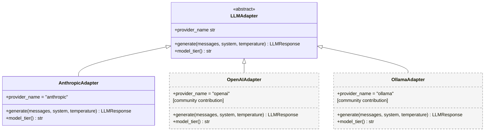
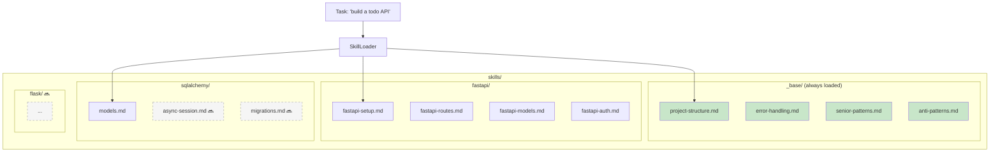
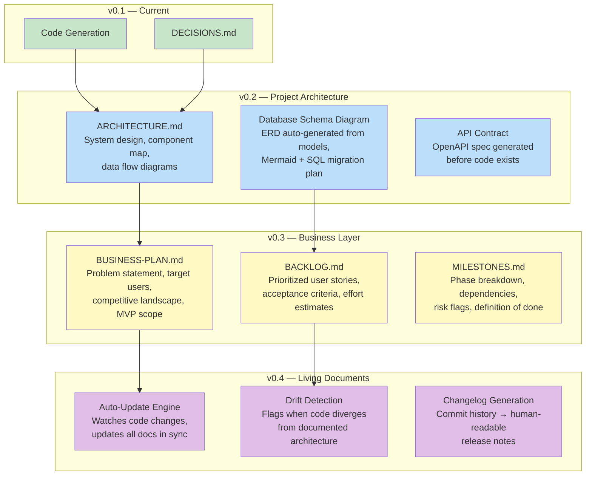
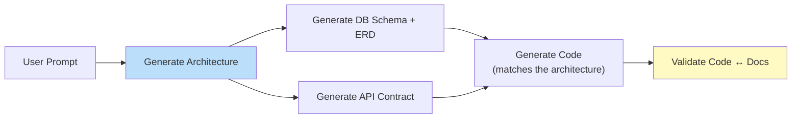
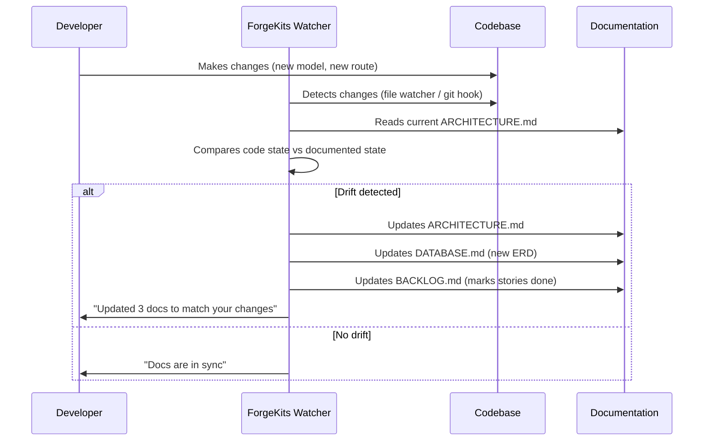

<p align="center">
  
</p>

<h1 align="center">ForgeKits</h1>

<p align="center">
  <strong>AI-powered POC scaffolder — senior-level Python projects from a single prompt.</strong>
</p>

<p align="center">
  <a href="#usage">Usage</a> •
  <a href="#how-it-works">How It Works</a> •
  <a href="#future-integrations">Roadmap</a> •
  <a href="#contributing">Contributing</a>
</p>

ForgeKits is an open-source CLI tool that takes a one-line description of what you want to build and produces a complete, production-quality Python project with proper architecture, error handling, and documentation — the kind of code a senior engineer would write.

Built for junior developers and vibe coders who want to ship fast without shipping garbage.

```bash
pip install forgekits
forgekits "build a todo REST API with auth"
```

---

## Why ForgeKits?

| Without ForgeKits | With ForgeKits |
|---|---|
| Flat file structure, everything in `app.py` | Service layer, proper separation of concerns |
| No error handling, bare `except: pass` | Custom exceptions, domain-specific error codes |
| Hardcoded secrets in source code | Environment-based config with `.env.example` |
| No documentation, no context for the next developer | Auto-generated `DECISIONS.md` explaining every choice |
| Business logic in route handlers | Thin controllers → service layer → data layer |
| No type hints, no validation | Full type annotations, Pydantic schemas |

---

## How It Works

### High-Level Flow



### Three-Layer Architecture



### Pipeline Phase Execution

ForgeKits generates projects in sequential phases, passing context between them via **envelopes** — a pattern borrowed from [IRIS](https://github.com/Artiselite/IRIS).



### Model Routing

The agent picks its own model — twice. First at startup based on task complexity, then refined per-phase.



### Provider Adapter Pattern

ForgeKits ships with Anthropic (Claude) but is designed for any provider.



### Skill System

Skills are markdown files with YAML frontmatter — the core product. They encode senior-level knowledge that shapes every generated project.



---

## Usage

### Direct Mode
```bash
forgekits "build a todo REST API with auth"
# → output/build-a-todo-rest-api-with-auth/
```

### Interactive Mode
```bash
forgekits
# What are you building? > a bookstore API
# Framework? > fastapi
# Database? > postgresql
# Need authentication? > yes
# Include Docker setup? > yes
```

### Spec File Mode
```bash
forgekits --from workspace/my-project-spec.md
```

### Options
```bash
forgekits "build an API" --output ~/projects/my-api    # custom output path
forgekits "build an API" --model opus                   # force a specific model
forgekits "build an API" --provider anthropic            # select provider
forgekits "build an API" --verbose                       # show skill loading, model picks
```

---

## Generated Project Structure

Every project ForgeKits generates follows this structure:

```
my-project/
├── src/
│   └── my_project/
│       ├── __init__.py
│       ├── main.py              # app factory with lifespan events
│       ├── config.py            # env-based configuration
│       ├── database.py          # async SQLAlchemy session
│       ├── models/              # SQLAlchemy models
│       ├── schemas/             # Pydantic request/response schemas
│       ├── services/            # business logic (one per domain)
│       ├── routes/              # thin API controllers
│       └── exceptions.py        # custom domain exceptions
├── tests/
├── pyproject.toml
├── Dockerfile
├── .env.example
├── .gitignore
├── README.md                    # setup instructions + API docs
├── DECISIONS.md                 # why every choice was made
└── CLAUDE.md                    # AI help for the developer after scaffolding
```

---

## Project Structure

```
forgekits/
├── src/forgekits/               # the Python package
│   ├── cli.py                   # Layer 1 — user interface
│   ├── models.py                # shared data types
│   ├── orchestrator.py          # the brain — connects everything
│   ├── adapters/                # provider-agnostic LLM interface
│   │   ├── base.py              # abstract adapter contract
│   │   ├── anthropic.py         # Claude implementation
│   │   └── registry.py          # adapter discovery
│   ├── router/                  # task analysis + model selection
│   │   ├── classifier.py        # complexity analysis
│   │   └── model_picker.py      # model routing logic
│   ├── pipeline/                # multi-phase generation
│   │   ├── phase.py             # single phase execution
│   │   ├── envelope.py          # context passing between phases
│   │   └── runner.py            # pipeline orchestration
│   ├── skills/                  # skill loader
│   │   └── loader.py            # parses markdown + YAML frontmatter
│   └── generator/               # file output
│       ├── writer.py            # writes files to disk
│       └── validator.py         # syntax + secret checking
├── skills/                      # THE PRODUCT — curated skill library
│   ├── _base/                   # always loaded
│   ├── fastapi/                 # FastAPI-specific patterns
│   ├── sqlalchemy/              # database patterns
│   └── _meta/                   # contributor guides
├── workspace/                   # user drops spec files here
├── output/                      # generated projects land here
└── tests/
```

---

## Future Integrations

### Self-Generating Project Intelligence

ForgeKits will evolve from a code scaffolder into a **full project architect**. The AI won't just generate code — it will generate everything a senior engineer produces before, during, and after writing code.



### v0.2 — Project Architecture Generation

The AI generates architectural documentation **before writing code**, then generates code that matches.

| Document | What It Contains | When It's Generated |
|---|---|---|
| `ARCHITECTURE.md` | System design, component boundaries, data flow, tech decisions | Phase 0 — before any code |
| `DATABASE.md` | ERD diagram (Mermaid), table definitions, index strategy, migration plan | Phase 1 — alongside data models |
| `API-CONTRACT.md` | OpenAPI spec, endpoint inventory, auth requirements, rate limits | Phase 1 — before routes are written |
| `DECISIONS.md` | Every architectural choice with rationale | Accumulated across all phases |



### v0.3 — Business Intelligence Layer

ForgeKits becomes a **product thinking partner**, not just a code generator.

| Document | What It Contains |
|---|---|
| `BUSINESS-PLAN.md` | Problem statement, target users, value proposition, competitive analysis, MVP scope |
| `BACKLOG.md` | User stories with acceptance criteria, priority (P0-P3), effort estimates, dependencies |
| `MILESTONES.md` | Phased delivery plan, risk flags, definition of done per milestone |
| `TECH-STACK.md` | Why each technology was chosen, alternatives considered, migration paths |

### v0.4 — Living Documentation Engine

Documents don't rot. When code changes, docs update automatically.



### v0.5+ — Planned Integrations

| Feature | Description |
|---|---|
| **Flask support** | Skills + pipeline phases for Flask projects |
| **Django support** | Full Django project generation with admin, ORM, migrations |
| **TypeScript/Node** | Second language support — Express, Fastify, NestJS |
| **OpenAI adapter** | Community-contributed provider for GPT models |
| **Ollama adapter** | Local model support — fully offline generation |
| **Test generation** | Auto-generate pytest test suite alongside application code |
| **CI/CD generation** | GitHub Actions, Docker Compose, deployment configs |
| **Skill marketplace** | Community-contributed skill packs installable via CLI |
| **VS Code extension** | Run ForgeKits from the editor, preview generated structure |

---

## Contributing

### Adding a New Skill
1. Create a `.md` file in the appropriate `skills/` subfolder
2. Add YAML frontmatter (see `skills/_meta/skill-format.md`)
3. Write rules, patterns, and anti-patterns
4. Test with `forgekits "your test prompt" --verbose`
5. Submit a PR

### Adding a New Provider
1. Create `src/forgekits/adapters/your_provider.py`
2. Subclass `LLMAdapter` from `adapters/base.py`
3. Register in `adapters/registry.py`
4. Submit a PR

---

## Acknowledgments

- **[IRIS](https://github.com/Artiselite/IRIS)** — The context envelope pattern and skill system architecture are inspired by IRIS, an intelligent runtime system for Claude Code by [@Artiselite](https://github.com/Artiselite).

---

## License

MIT
